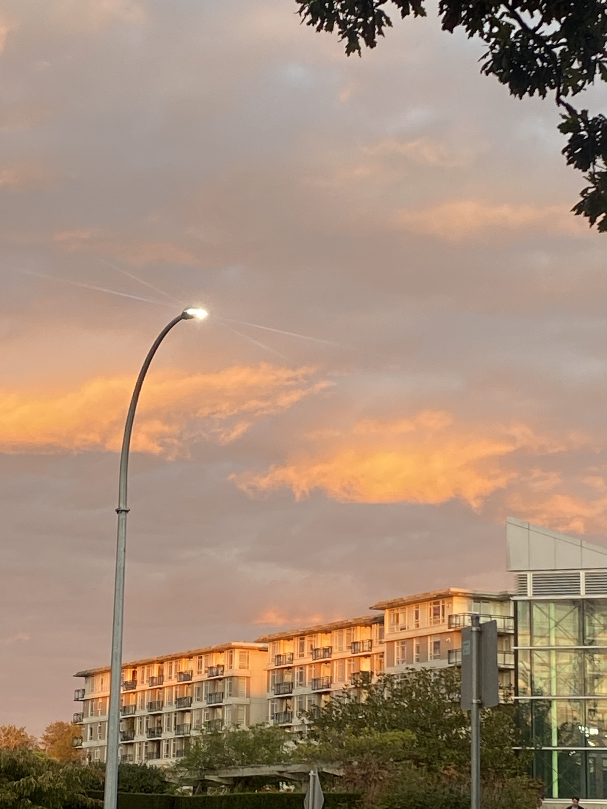
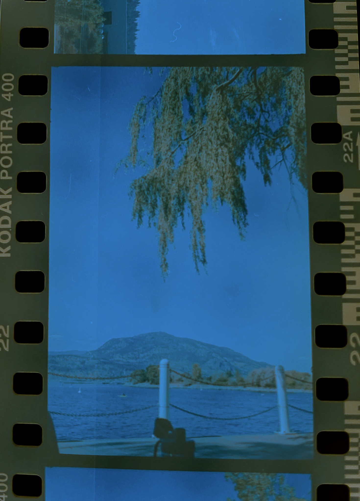
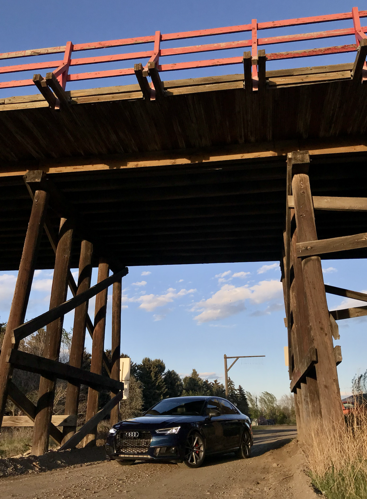
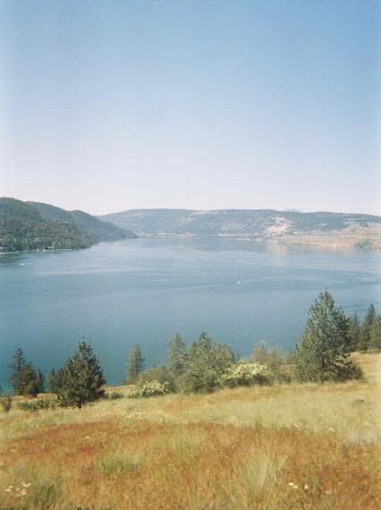
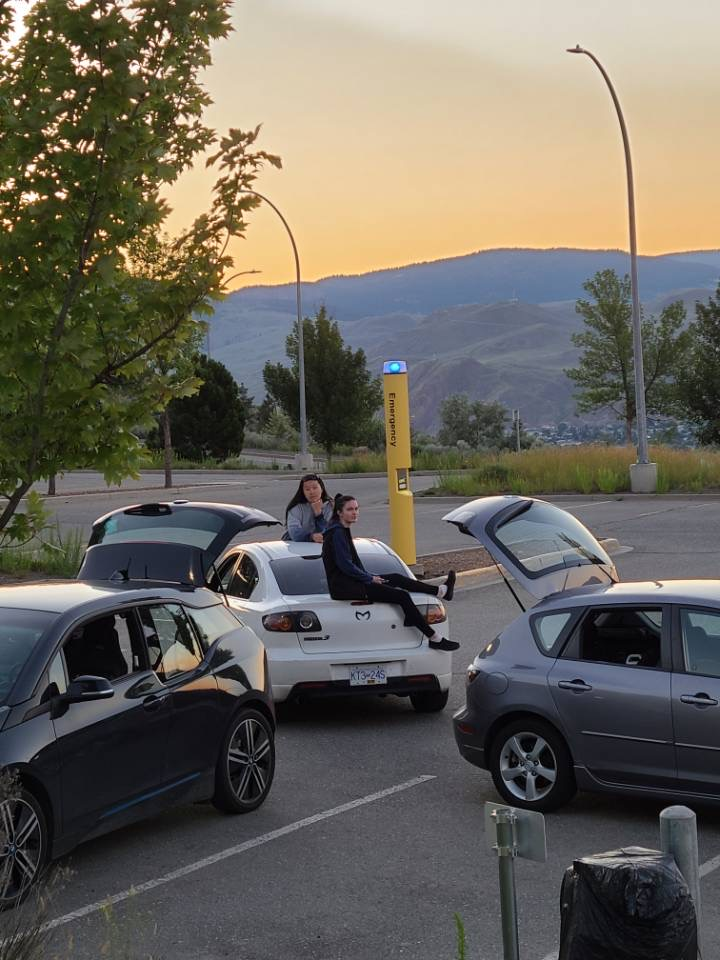

<!-- Gallery -->

  

   

    
    

  

    
    

        
Finally caught a summer sunset at Tower Beach, Vancouver

    

   

    

    
    

        
One of the prettiest sunsets I have seen while walking back from class.

    

   

   

    
    

        
Playing around with digitally processing some negatives.

    

   

  

  

     

    
    
  
    

    
    

        
Taken while hiking in Banff. Not edited!

    

    

    

    
    

        
Quick shot of my favourite Audi

    

    

  

  

    
    

    
    

    

    
    

        
Film capturing my friends and I lighting sparklers.

    

   

   

    
    

        
Friends and cars! I love fixing and working on cars 

    

   

  

<!-- Gallery -->
